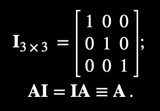
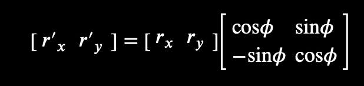
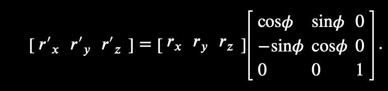
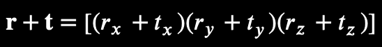
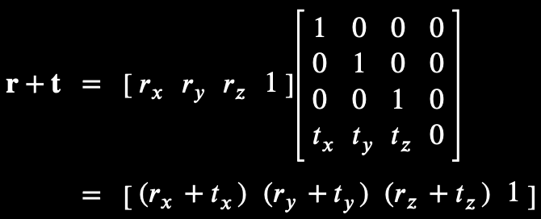
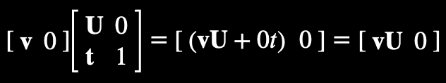

# Matrices

- 3x3 matrices are called "special orthogonal" (or "orthonormal") matrices and can represent "pure" rotations
- 4x4 matrices are "transformation matrices" and can represent rotation, translation, and scale.
- The inverse of a matrix is the matrix undoes the effects of a matrix. The inverse of `A` is represented as `A^-1`
- The transpose of a matrix is denoted with `A^T`, the inverse of a orthogonal (pure rotation) matrix is equal to its transpose

#### Combining

- If `P = A * B`, then `P` applies `A` and `B` (e.g., if `A` scales and `B` rotates then `P` scales and rotates)

## Identity

An identity matrix is a matrix that when multiplied by any other matrix, yields the same matrix. It's represented by the symbol **I**, and it's always a square matrix with `1` along the diagonal and `0` everywhere else:

## Rotation

Rotate a 2x2 matrix in two dimensions:

This really a 3D rotation around the *z*-axis.

Rotation a 3x3 matrix:

A 3x3 matrix cannot represent translations because translating a point **R** by a translation **T** requires adding the components of **t** to the components of **r** individually:

There's no way to arrange the components of **t** within a 3x3 matrix such that the result of multiplying it with the column vector **r** yields sums (like `r~x + t~x`).

You can obtain sums like this with a 4x4 matrix. The upper 3x3 should contain the identity matrix, so there's no rotation. Then we arrange the components of **t** across the bottom-most row.

This yields `(1 * r~x) + (0 * r~y) + (0 * r~z) + (t~x * 1)`.

When a point or vector is extended from three dimensions to four, we say it has been written in "homogeneous coordinates".

## w Component

The *w* component is the fourth coordinate of a three dimensional matrix (e.g., x, y, z, w).

Points have their *w* component equal to `1`, while vectors have it equal to `0`. In this example, note how `w = 0` multiplies with **t**, eliminating the translation in the final result:

Dividing by `w = 1` has no effects on the coordinates of a point, where was dividing by `w = 0` yields infinity. A point at infinity in 4D can be rotated but not translated (because a translated point will always be at infinity).
