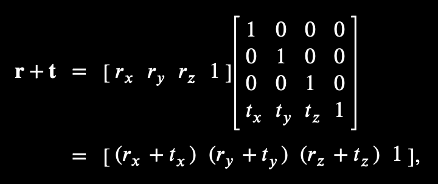
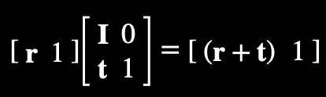
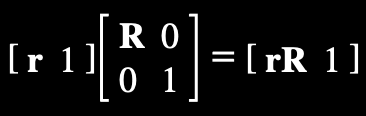
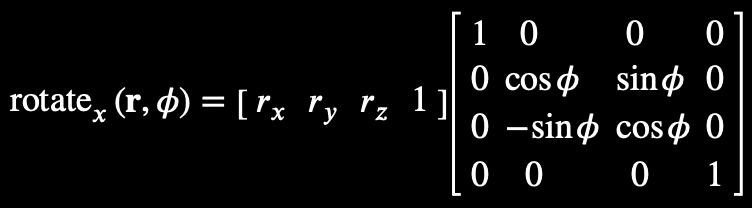
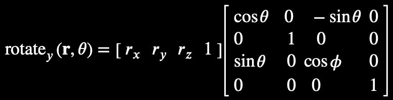
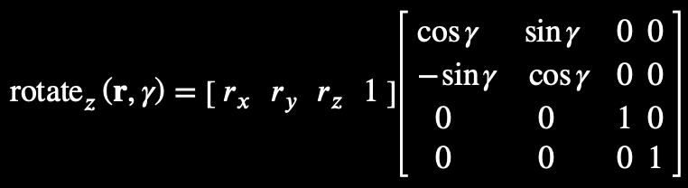
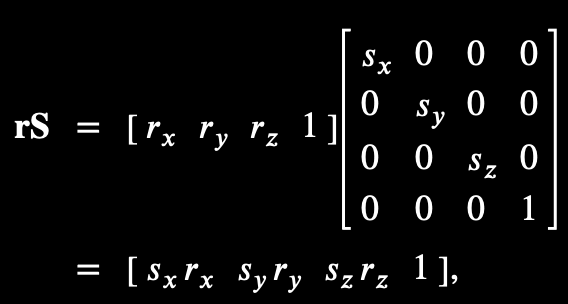
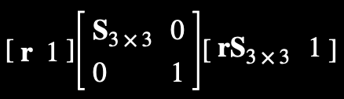

# Matrices

- 3x3 matrices are called "special orthogonal" (or "orthonormal") matrices and can represent "pure" rotations
- 4x4 matrices are "transformation matrices" and can represent rotation, translation, and scale.
- The inverse of a matrix is the matrix undoes the effects of a matrix. The inverse of `A` is represented as `A^-1`
- The transpose of a matrix is denoted with `A^T`, the inverse of a orthogonal (pure rotation) matrix is equal to its transpose

#### Combining

- If `P = A * B`, then `P` applies `A` and `B` (e.g., if `A` scales and `B` rotates then `P` scales and rotates)

## Identity

An identity matrix is a matrix that when multiplied by any other matrix, yields the same matrix. It's represented by the symbol **I**, and it's always a square matrix with `1` along the diagonal and `0` everywhere else:

## Rotation

Rotate a 2x2 matrix in two dimensions:

This really a 3D rotation around the *z*-axis.

Rotation a 3x3 matrix:

A 3x3 matrix cannot represent translations because translating a point **R** by a translation **T** requires adding the components of **t** to the components of **r** individually:

There's no way to arrange the components of **t** within a 3x3 matrix such that the result of multiplying it with the column vector **r** yields sums (like `r~x + t~x`).

You can obtain sums like this with a 4x4 matrix. The upper 3x3 should contain the identity matrix, so there's no rotation. Then we arrange the components of **t** across the bottom-most row.

This yields `(1 * r~x) + (0 * r~y) + (0 * r~z) + (t~x * 1)`.

When a point or vector is extended from three dimensions to four, we say it has been written in "homogeneous coordinates".

## w Component

The *w* component is the fourth coordinate of a three dimensional matrix (e.g., x, y, z, w).

Points have their *w* component equal to `1`, while vectors have it equal to `0`. In this example, note how `w = 0` multiplies with **t**, eliminating the translation in the final result:

Dividing by `w = 1` has no effects on the coordinates of a point, where was dividing by `w = 0` yields infinity. A point at infinity in 4D can be rotated but not translated (because a translated point will always be at infinity). Pure direction vectors in 3D space act like a point at infinity in 4D homogeneous space.

## Translation

The following matrix translates a point by the vector **t**:

Or in partitioned shorthand:

## Rotation

4x4 pure rotation matrices have the form:

The **t** vector is zero, and the upper 3x3 matrix **R** contains cosines and sines of the rotation angle, measured in radians.

Rotation about the x-axis by an angle `ϕ`:

Rotation about the y-axis by an angle `θ` (notice this is transposed relative to the other two, the positive and negative sine terms have been reflected across the diagonal):

Rotation about the z-axis by an angle `γ`:

### Notes

- The `1` in the upper 3x3 always appears on the axis we're rotating about, while the sine and cosine terms are off-axis.
- Positive rotations go from x to y (about z), from y to z (about x) and from z to x (about y). The z to x rotation wraps around, which is why it's transposed relative to the other two.
- The inverse of a pure rotation is its transpose. This works because inverting a rotation is equivalent to rotating by the negative angle (e.g., `cos(−θ) = cos(θ) while sin(−θ) = − sin(θ)` negating the angle causes the two sine terms to effectively switch places, while the cosine terms stay put).

## Scale

