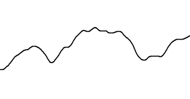

# Perlin Noise

Perlin noise was originally developed for procedural textures of objects. Perlin noise gives you random numbers that change smoothly over time.

- Perlin noise is rendered in 3D space, and getting the value for `xoff`, `yoff`, `zoff` is getting that value at those coordinates.
- `xoff`: x-offset, the offset values are better thought of as points in time along the graph
