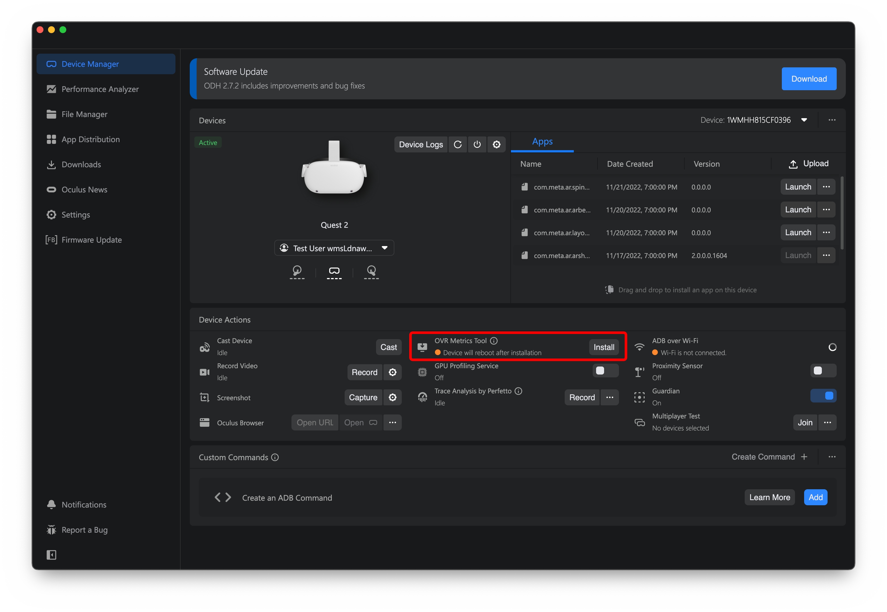
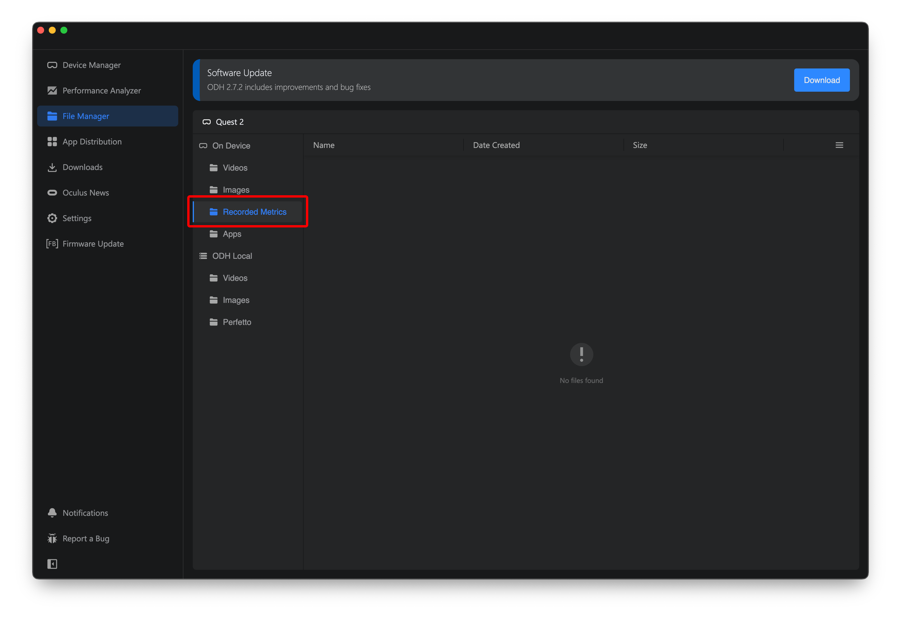

# OVR Metrics Tool

1. Install OVR Metrics Tool from Oculus Developer Hub

    

2. Enable it on device in settings
3. Collect logs from Oculus Developer Hub (these will be organized by App ID)

    
