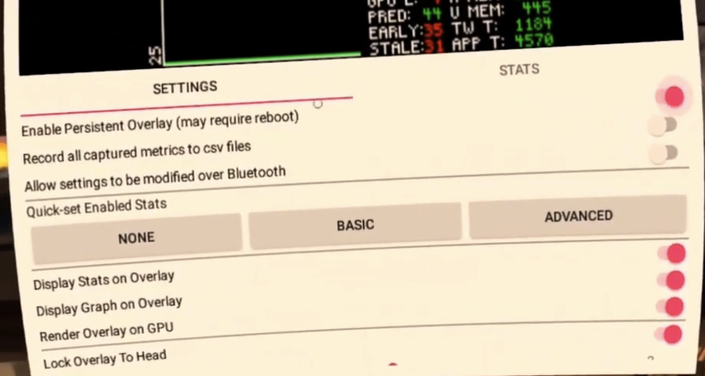
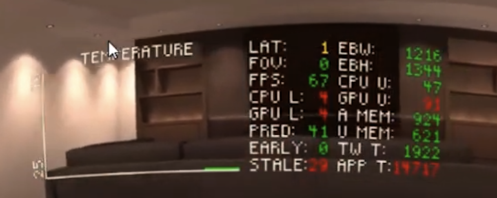

# OVR Metrics Tool

1. Install OVR Metrics Tool from Oculus Developer Hub

    

2. Enable it on device in settings

    

3. The overlay

    

## Collecting Metrics

Collect logs from Oculus Developer Hub (these will be organized by App ID)

    

## Notes

- `Quick-set Enable Stats`: Click `Basic` to quickly get FPS
