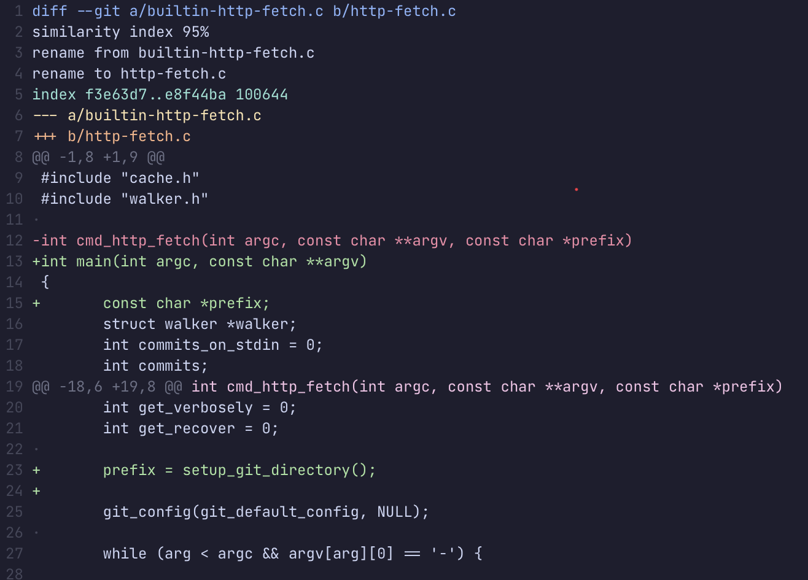

# Unified Diff Format



`diff --git a/builtin-http-fetch.c b/http-fetch.c`

Header, `--git` is `git` diff format, `a/` and `b/` files are the same unless there was a rename.

```
similarity index 95%
rename from builtin-http-fetch.c
rename to http-fetch.c
```
How the rename was determined

```
--- a/builtin-http-fetch.c
+++ b/http-fetch.c
```

Two-line unified diff header

```
@@ -1,8 +1,9 @@
```

`@@ -<from-file-range> +<to-file-range> @@`

The file ranges are `<start-line>,<number-of-lines>`

- `<start-line>` and `<number-of-lines>` refer to position and length of hunk
- `-` means old file, and `+` means new
- If `<number-of-lines>` is omitted, then it's one
- if the last line does not end with a newline, then a it is displayed with a new line and `\ No newline at end of file` is outputted
